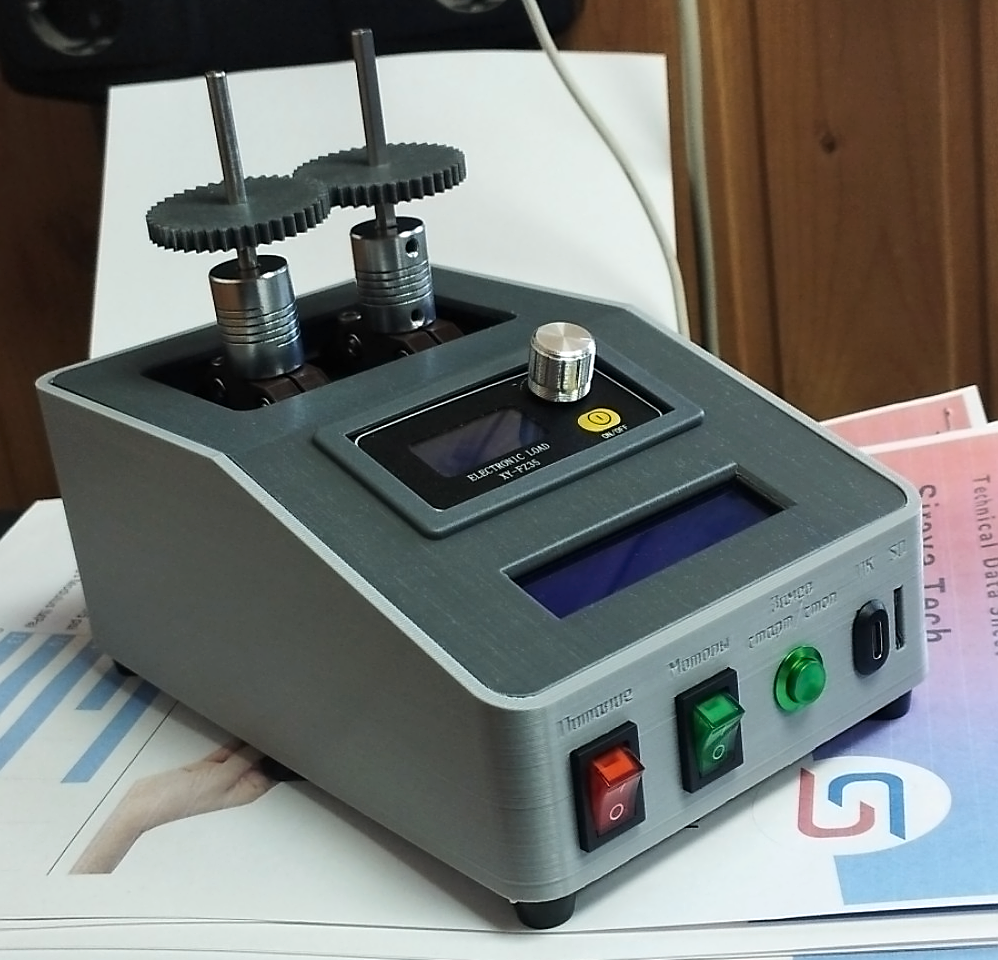

# GearTest

**Тестовый стенд для 3D-печатных шестерёнок**
<p align="left">
  
</p>
[](https://www.gnu.org/licenses/gpl-3.0)
[](https://github.com/Rizz071/GearTest/commits/main)
[](https://github.com/Rizz071/GearTest)

---

## 🎯 О проекте

**GearTest** — это полностью открытый тестовый стенд, предназначенный для **испытания 3D-печатных шестерёнок на износ до полного отказа**.

**Главная цель**: довести пару шестерён до разрыва зацепления зубьев и точно зафиксировать момент разрушения с подробным **логированием всех параметров** в десктопное приложение на ПК.

Это позволяет объективно сравнивать долговечность разных материалов (PLA, PETG, ABS, ASA, Nylon и др.), профилей зубьев, параметров печати и постобработки.

---

## ✨ Ключевые возможности

- ✅ Автоматическая остановка при разрушении зацепления  
- ✅ Точный подсчёт времени работы до отказа  
- ✅ Логирование в реальном времени (время, нагрузка)  
- ✅ Удобное десктопное приложение для визуализации и анализа  
- ✅ Сохранение отчётов в CSV + построение графиков  
- ✅ Полностью открытый проект (hardware + software + CAD)

---

## 🛠️ Как это работает

1. В стенд устанавливается пара тестируемых шестерён  
2. Приводной мотор запускает непрерывное вращение под заданной нагрузкой  
3. Система мониторит параметры в реальном времени  
4. При разрыве зубьев (резкое изменение нагрузки/обрыв зацепления) испытание останавливается автоматически  
5. Все данные мгновенно сохраняются и отображаются в приложении на ПК

---

## 📁 Структура репозитория

```bash
GearTest/
├── CAD/          # 3D-модели стенда и шестерёнок
├── Docs/         # Полная документация, схемы, методика испытаний
├── GearTest/     # Исходный код
├── images/       # Фото и скриншоты
├── results/      # Примеры протоколов испытаний (появится позже)
└── LICENSE       # GNU GPL v3.0
